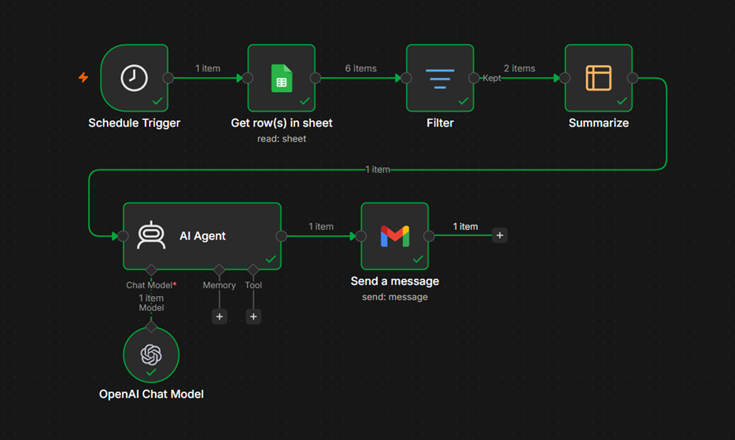

# Weekly Invoice Report Generator

Automated invoice reporting workflow built with n8n.

This workflow automatically retrieves invoice data from Google Sheets, analyzes invoices from the last 7 days, generates an AI-powered business summary, and sends a weekly report via email.

## Workflow



## Workflow Architecture

```text
Weekly Schedule (Monday 9:00 AM)
           │
           ▼
    Google Sheets
           │
           ▼
   Filter Last 7 Days
           │
           ▼
   Calculate Metrics
           │
           ▼
    AI Report Agent
           │
           ▼
      Gmail Report
```

## Overview

The workflow runs automatically every Monday at 9:00 AM.

Invoice records are retrieved from a private Google Sheets document and filtered to include only invoices from the previous seven days.

The workflow calculates key business metrics, including:

* Total number of invoices
* Average invoice value
* Total revenue
* Highest invoice value

These metrics are sent to an AI Agent, which generates a concise executive summary and delivers it via email.

## Features

* Weekly scheduled execution
* Google Sheets integration
* Date-based filtering
* Invoice aggregation
* AI-generated business reporting
* Automated email delivery
* Low-code workflow automation

## Technologies

* n8n
* Google Sheets
* Gmail
* OpenAI GPT-4o-mini
* Workflow Automation

## Data Source

The workflow connects to a private Google Sheets document containing invoice records.

Expected schema:

| Column         | Type   |
| -------------- | ------ |
| date           | Date   |
| invoice_amount | Number |

Example dataset:

| date       | invoice_amount |
| ---------- | -------------: |
| 2025-12-23 |            100 |
| 2025-12-24 |          20000 |
| 2025-12-25 |            350 |
| 2025-12-26 |          10000 |
| 2026-06-20 |            200 |
| 2026-06-22 |          35000 |

> Note: The actual Google Sheet used by the workflow is private. The table above is provided for demonstration purposes only.

## Workflow Steps

### 1. Scheduled Execution

The workflow runs automatically every Monday at 9:00 AM.

### 2. Data Retrieval

Invoice records are loaded from Google Sheets.

### 3. Date Filtering

Records older than 7 days are excluded from processing.

### 4. Metric Calculation

The workflow calculates:

* Invoice count
* Average invoice amount
* Total invoice revenue
* Maximum invoice amount

### 5. AI Summary Generation

An AI Agent generates a concise business report based on the calculated metrics.

### 6. Email Delivery

The generated report is automatically sent through Gmail.

## Sample Report

```text
Weekly Invoice Summary

During the past week, 2 invoices were processed.

The average invoice value was $17,600.00 and total revenue reached $35,200.00. The highest invoice amount recorded was $35,000.00.

Overall, invoice activity remained strong during the reporting period.

Regards,
Automated Reporting Assistant
```

## Skills Demonstrated

* Workflow Automation
* Google Workspace Integration
* AI Integration
* Business Reporting
* Data Filtering
* Data Aggregation
* Scheduled Workflows
* Automated Email Delivery

## Learning Context

This project was created as part of an n8n workflow automation learning journey and demonstrates how AI can be integrated into automated business reporting workflows.
